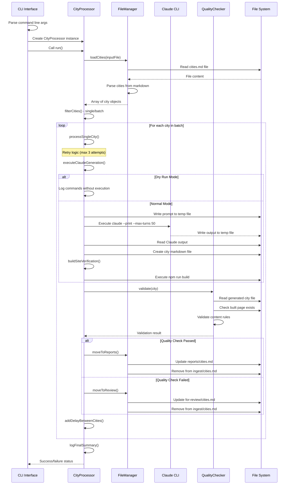
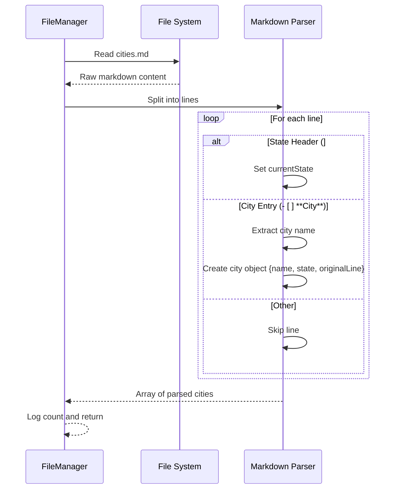
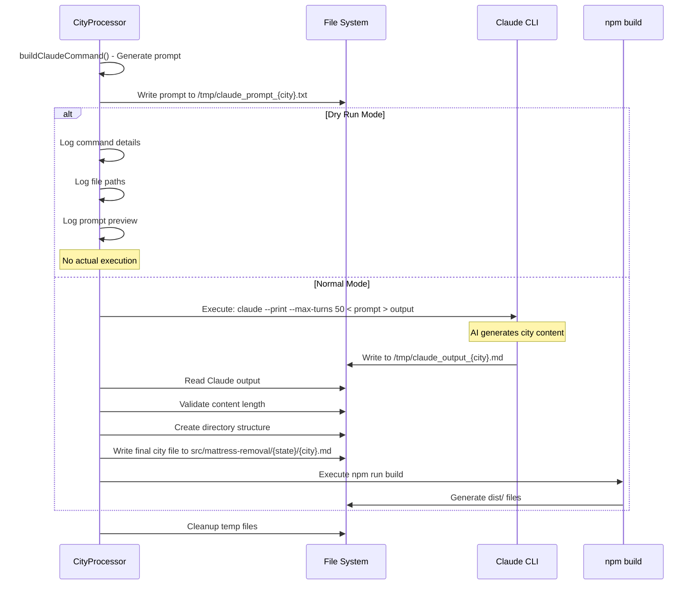
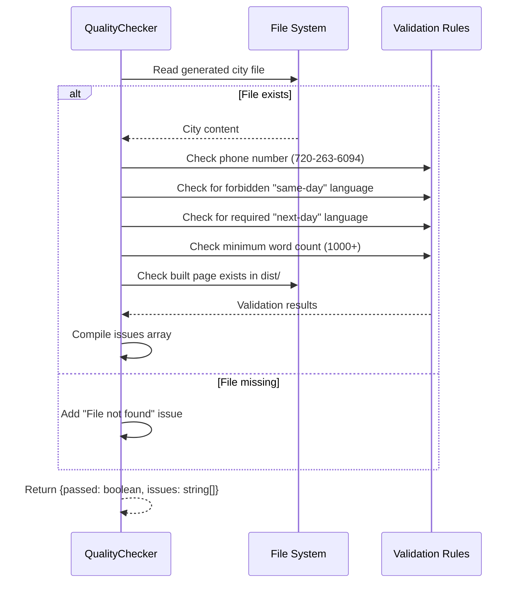
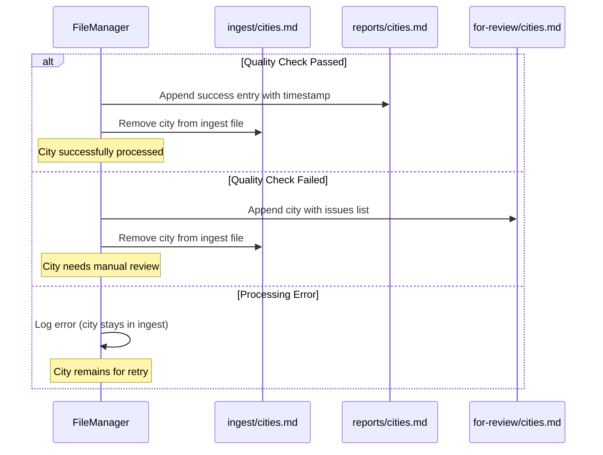
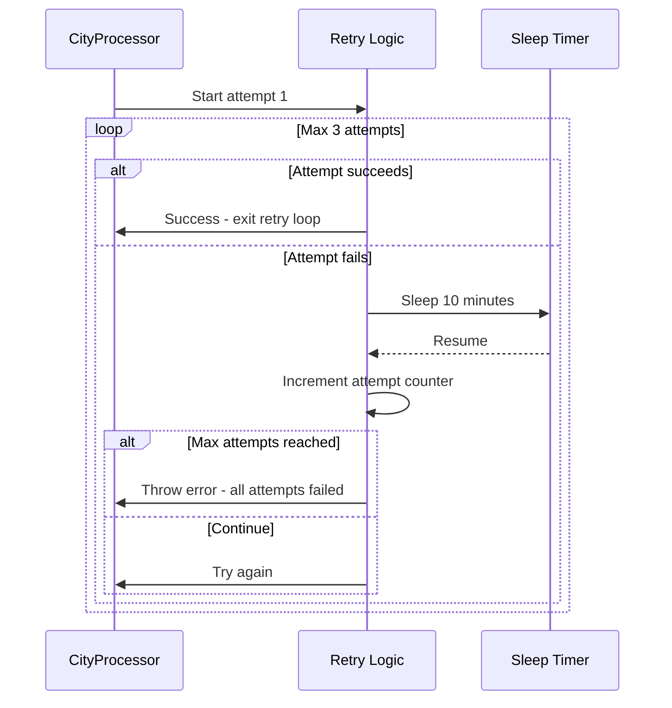

# City Runner Process Sequence

This document shows the complete workflow of the city runner system using Mermaid sequence diagrams.

## Overview Flow

## Detailed File Processing Flow

## Claude Generation Process

## Quality Validation Flow

## File Movement and Tracking

## Error Handling and Retry Logic

## Configuration and Options

The runner supports several configuration options that affect the flow:

- `--dry-run`: Skips all file operations and Claude API calls
- `--single <city>`: Processes only one specific city
- `--batch <n>`: Processes n cities (default: 10)
- `--delay <s>`: Delay between cities in seconds (default: 30)
- `--max-turns 50`: Allows up to 50 Claude iterations per city

## Key Files and Directories

- **Input**: `files/ingest/cities.md` - Cities to process
- **Success**: `files/reports/cities.md` - Successfully processed cities
- **Review**: `files/for-review/cities.md` - Cities needing manual review
- **Output**: `src/mattress-removal/{state}/{city}.md` - Generated city pages
- **Temp**: `/tmp/claude_prompt_*.txt` and `/tmp/claude_output_*.md`